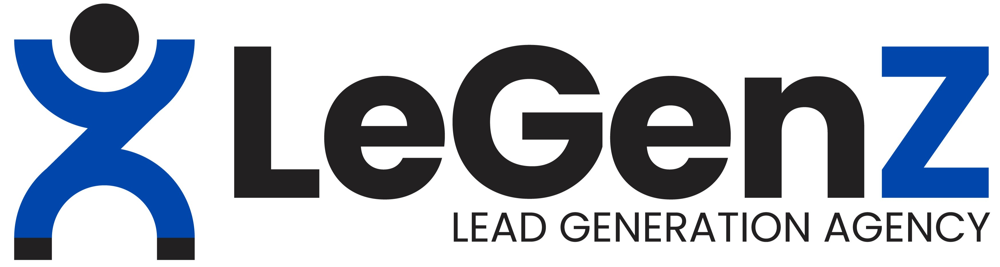

# LeGenZ — The Performance Marketing Agency

<div align="center">



<br/>

**Marketing Built for Buyers, Beyond Reach.**

[](https://github.com/sarma02/legenz/stargazers)
[](https://github.com/sarma02/legenz/network/members)
[](LICENSE)
[](#)

[Live Demo](#quick-start) • [Features](#key-features) • [Tech Stack](#technology-stack) • [Installation](#quick-start) • [Project Structure](#project-structure) • [Contact](#connect-with-us)

</div>

---

## 📌 Overview

**LeGenZ** is the official modern, performance-driven web platform for **LeGenZ Digital Solutions** — a premier performance marketing agency founded by Meta Ads Strategist **Santhosh Kumar**.

The agency specializes in engineering predictable, scalable revenue funnels through high-converting **B2B Meta & Google Ads campaigns**, conversion rate optimization (CRO), search engine optimization (SEO), and buyer-intent lead acquisition systems.

### 🌟 Track Record at a Glance
- 🎯 **100,000+** High-Quality, Buyer-Ready Leads Generated
- 💼 **₹1.5 Cr+** Direct Client Revenue Delivered
- 🏢 **72+** Diverse Brands Scaled Across Multiple Verticals
- ⭐ **1,200+** Satisfied Clients

---

## ✨ Key Features

### 🖥️ User Experience & Design
- **Modern Aesthetic**: Cobalt Blue brand identity (`#0047AB`), dark charcoal typography, glassmorphism (`backdrop-blur-md`), and gradient accents.
- **Fluid Micro-Animations**: Interactive floating shapes, blob gradients, hover micro-transitions, and scroll-triggered fade-up effects (`IntersectionObserver`).
- **Real-Time Scroll Progress Indicator**: Thin, branded progress indicator pinned to the top of the viewport reflecting page reading depth.
- **Dynamic Preloader**: Animated branded loading screen with realistic progress feedback.

### ⚡ Interactive Functionalities
- **Instant Site-Wide Search Modal**: In-memory quick search querying headings, services, and content blocks with live preview snippets, automatic categorization, and smooth scroll highlighting.
- **Dynamic Animated Counters**: Number count-up animations for key business milestones activated upon entry into the viewport.
- **Interactive Testimonial Carousel**: Multi-item review carousel with smooth fade transitions, client details, star ratings, and dot pagination.
- **Sticky Navbar with ScrollSpy**: Automatically tracks the user's reading position on the page and highlights the active navigation menu item.
- **Interactive Lead Capture Form**: Asynchronous feedback simulation, state indicators (submitting, success), and automatic form resets.
- **Floating WhatsApp Quick-Connect**: Direct one-click chat button linking visitors directly with the strategist.
- **Back-to-Top Button**: Smooth scrolling utility that reveals when users navigate past the fold.
- **Legal Compliance Pages**: Dedicated, fully-styled [Privacy Policy](privacy_policy.html) and [Terms and Conditions](terms_and_conditions.html) documents.

---

## 🛠️ Technology Stack

| Technology | Purpose |
| :--- | :--- |
| **HTML5** | Semantic structure, accessibility, and SEO meta/Open Graph tags |
| **Tailwind CSS** | Utility-first styling configured with customized brand tokens |
| **Vanilla CSS3** | Custom keyframes, gradient cards, smooth scrolling, and custom responsive breakpoints |
| **Vanilla JavaScript (ES6+)** | Search engine logic, intersection observers, carousel state, and DOM animations |
| **Font Awesome 6** | Scalable vector icons for services, features, and social channels |
| **Google Fonts** | *Poppins* typography suite for crisp readability |

---

## 📂 Project Structure

```text
legenz/
├── asstets/                    # Image & brand visual assets
│   ├── fulllogo.jpg            # Primary rectangular logo banner
│   ├── onlylogo-withbg.png     # Logo icon with solid background
│   └── onlylogo.png            # Transparent logo icon
├── index.html                  # Main landing page & agency showcase
├── privacy_policy.html         # Official Privacy Policy
├── terms_and_conditions.html   # Terms & Conditions documentation
├── script.js                   # Interactive client-side logic & search engine
├── style.css                   # Custom stylesheets, variables, and animations
└── README.md                   # Project documentation & GitHub overview
```

---

## 🚀 Quick Start

This project requires **no complex build steps or dependencies** — it runs out of the box in any modern browser.

### 1. Clone the Repository
```bash
git clone https://github.com/sarma02/legenz.git
cd legenz
```

### 2. Run Locally

#### Option A: Direct Open
Simply double-click [`index.html`](index.html) or open it directly in Google Chrome, Edge, Firefox, or Safari.

#### Option B: Using VS Code Live Server
1. Install the [Live Server](https://marketplace.visualstudio.com/items?itemName=ritwickdey.LiveServer) extension in VS Code.
2. Right-click [`index.html`](index.html) and select **"Open with Live Server"**.

#### Option C: Using Python Simple Server
```bash
# Python 3.x
python -m http.server 3000
```
Navigate to `http://localhost:3000` in your web browser.

#### Option D: Using Node.js `npx serve`
```bash
npx serve .
```

---

## 🌐 Deployment

This static site can be deployed instantly to any modern hosting platform:

### Deploy to GitHub Pages
1. Go to your repository **Settings** on GitHub.
2. Select **Pages** from the left navigation menu.
3. Under **Branch**, select `main` and root `/` folder.
4. Click **Save**. Your site will be live within a few minutes!

### Alternative Deployment Options
- **Vercel**: Import the GitHub repo and deploy with default static presets.
- **Netlify**: Drag-and-drop the directory or connect through GitHub with publish directory `./`.
- **Cloudflare Pages**: Connect the Git repository and select static output.

---

## 📱 Connect with Us

- **Founder & Strategist**: Santhosh Kumar
- **Instagram**: [@santhosh_legenz](https://www.instagram.com/santhosh_legenz)
- **LinkedIn**: [Santhosh Kumar](https://www.linkedin.com/in/i-santhoshkumar/)
- **YouTube**: [@legenzmarketingtamil](https://youtube.com/@legenzmarketingtamil)
- **Facebook**: [LeGenZ Digital](https://www.facebook.com/share/1AE1yHuvzP/)
- **WhatsApp**: [+91 84282 73301](https://wa.me/918428273301)

---

## 📄 License

This project is licensed under the [MIT License](LICENSE) — see the LICENSE file for details.

<div align="center">
  <sub>Built with ❤️ for performance marketing excellence by <a href="https://github.com/sarma02">sarma02</a> & LeGenZ.</sub>
</div>
